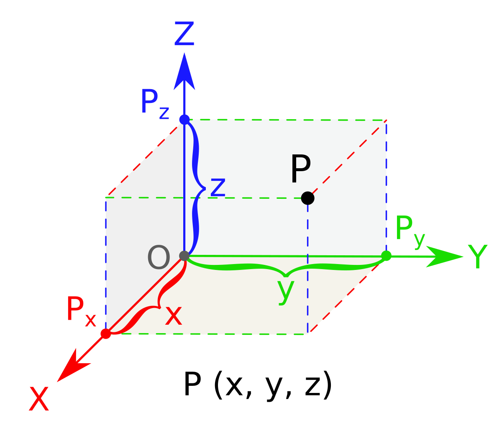

# TEST BACK

Create API to register a new user with a pseudo in payload

## Requirements  
* ruby 2.7.3  
* psql (PostgreSQL) 11.0  

## Setup
### Dependencies

```bash  
bundle install  
```  
### Database creation  
  
```bash  
bundle exec rake db:create  
bundle exec rake db:migrate  
```  

### Test
run rspec test for `integration`, `models`, `requests`, `routing`
```bash  
rspec
```  

### Run

```bash  
rails s -p 4000
```  

Test the API at http://localhost:4000/api-docs/index.html with Swagger UI

## API
There are two endpoints:

### `POST /api/v1/users`
Create new user with the pseudo in payload

**payload**

```json
{
  "pseudo": "string"
}
```

### `GET /api/v1/users`
Retrieve all users in database, we don't need to open database to check the result of the creation user.

### Architecture
- Swagger for the document and test API
- Rubocop for the code formatter
- Concerns
- Complexity `O(log(n))` with the binary search algorithm

#### Solution for the research a pseudo available
This is the principle problem in this test and It's so interesting.

There are many solution for that, but the performance and the complexity is not the same.

##### 1. Store data

This is the first solution that I thought when I saw the test.

We will store all of the case of pseudo with three letters from A-Z in database, so we have to create $26^3 = 17567$ lines.

Each pseudo in the table will be tagged by un boolean `available=true` by default. When a new user is created with a pseudo, the tag `available` of the pseudo will be set to `false`.

So, we can check if a pseudo is available or not and find a new pseudo available by using request SQL in this table.

This solution is not good, it cost the volume in database and in the case pseudo has 4, 5 or 6... letter we have to insert so many line.

##### 2. Basic loop

This is the basic solution with the complexity `$O(n^3)$` to find a pseudo available

```ruby
[A...Z].each do |first|
  [A...Z].each do |second|
    [A...Z].each do |third|
        find...
    end
  end
end
```
Complexity `$O(n^3)$`. I don't like that

##### 3. Vector 3 dimensions

A pseudo can be like a vector in the dimension 3D `O(x,y,z)` with the value in `Ox`, `Oy`, `Oz` is `[A...Z]` instead of `1, 2 ,...]`.
  
Each pseudo is a vector, We can use the notion vector in Math to find the pseudo available like find a vector available in the coordinates 3 dimensions.

Now, I don't have the solution for this idea, but for me it is an interesting idea and we can use it to find the pseudo near the pseudo exist.

##### 4. Binary search

This is the solution was used in this test.

Each letter will be converted to a number and revert(letter <-> decimal). Example:

- A <-> 1
- B <-> 2
- Z <-> 26

So we can convert a pseudo to a number and revert. Example:

- `$ABC = 1*(26^2) + 2*26 + 3 = 731$` Function in project: `pseudo_to_decimal`
- `$731 = 1*(26^2) + 2*26 + 3 => ABC$` Function in project: `decimal_to_pseudo`

In the table `User` there are 2 attributes: `pseudo` and `decimal_index`. The value in `decimal_index` is the value of `pseudo` after converted.

To find the new pseudo available, we will find a new `decimal_index` available and convert the value found to pseudo.

`AAA = 26^2 + 26 + 1 = 703` so the number minimum for `decimal_index` is 730

Now the problem become: **For an array number, find a number is not in the array (min_value = 0, max_vale = n)**

- Sort the array
- `array[index]` is always greater or equal `index`
- if `array[index] = index` there are no number available in array from `[0...index]`. Example: [0,1,2,3,4,6], from 0 to 4 there are any number available.
- if `array[index] > index` so there are at least a number available equal or less than `index`
- So if `array[index] = index` and `array[index +1] > index+1`, the value `index +1` is the number available.
- With these conditions above, we can apply the idea of the [binary search algorithm](https://en.wikipedia.org/wiki/Binary_search_algorithm) in this problem

